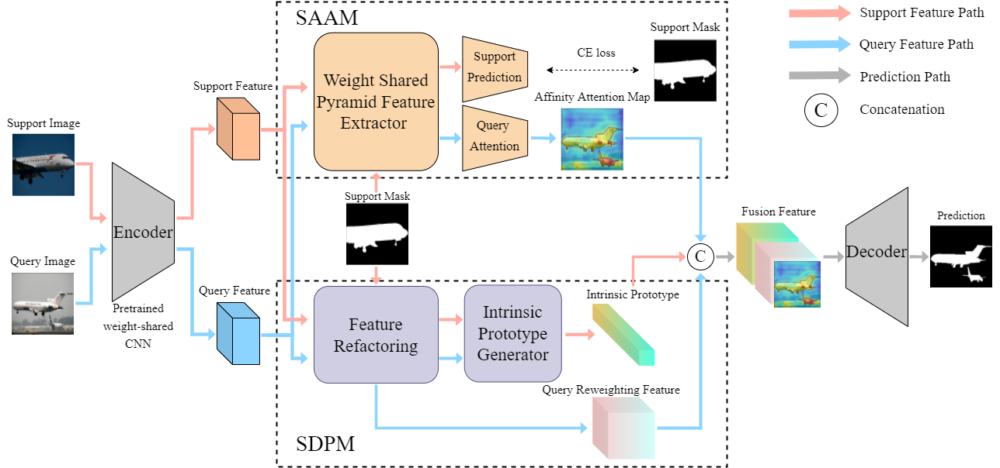

# SD-AANet

The code is for the paper "A Self-Distillation Embedded Supervised Affinity Attention Model for Few-Shot Segmentation" [[arxiv](https://arxiv.org/abs/2108.06600)]

<p align="left">
  
</p>


## Overview

+ `config/` includes config files
+ `lists/` includes train/validation list files
+ `model/` includes related model and module
+ `util/` includes data processing, seed initialization

## Usage

### Requirements

python==3.7, torch==1.8, scipy, opencv-python, tensorboardX

### Dataset

Please prepare related datasets: 

- Pascal-5<sup>i</sup> ([VOC 2012](http://host.robots.ox.ac.uk/pascal/VOC/voc2012/), [SBD](http://home.bharathh.info/pubs/codes/SBD/download.html)) 
- COCO-20<sup>i</sup> ([COCO 2014](https://cocodataset.org/#download))

Specify the paths of datasets in config files, including data root and list files paths

### Pre-trained models

We provide 8 pre-trained models: 4 ResNet-50 based models for Pascal-5i and 4 ResNet-101 based models for COCO-20i

- Download the pre-trained models [[Pre-trained models](https://drive.google.com/drive/folders/1ogVmjyFBHcB5e8o11_u7Dtsi9lwMb46M?usp=sharing)]
- Specify the split setting, shot setting and path of weights in config files

### Test and  Train

+ Use the following command for testing

  ```
  sh test.sh {data} {split_backbone}
  ```

E.g. Test SD-AANet with ResNet50 on the split 0 of PASCAL-5i:

```
sh test.sh pascal split0_resnet50
```

- Use the following command for training

  ```
  sh train.sh {data} {split_backbone}
  ```

E.g. Train SD-AANet with ResNet50 on the split 0 of PASCAL-5i:

```
sh train.sh pascal split0_resnet50
```

## Citation

If you have any question, please discuss with me by sending email to liubinghao@buaa.edu.cn

Please consider citing the paper if you find it useful:

```
@ARTICLE{10057432,
  author={Zhao, Qi and Liu, Binghao and Lyu, Shuchang and Chen, Huojin},
  journal={IEEE Transactions on Cognitive and Developmental Systems}, 
  title={A Self-Distillation Embedded Supervised Affinity Attention Model for Few-Shot Segmentation}, 
  year={2023},
  volume={},
  number={},
  pages={1-1},
  doi={10.1109/TCDS.2023.3251371}}
```

## References

The code is based on [PFENet](https://github.com/Jia-Research-Lab/PFENet) and [kd-pytorch](https://github.com/peterliht/knowledge-distillation-pytorch). Thanks for their great works!
